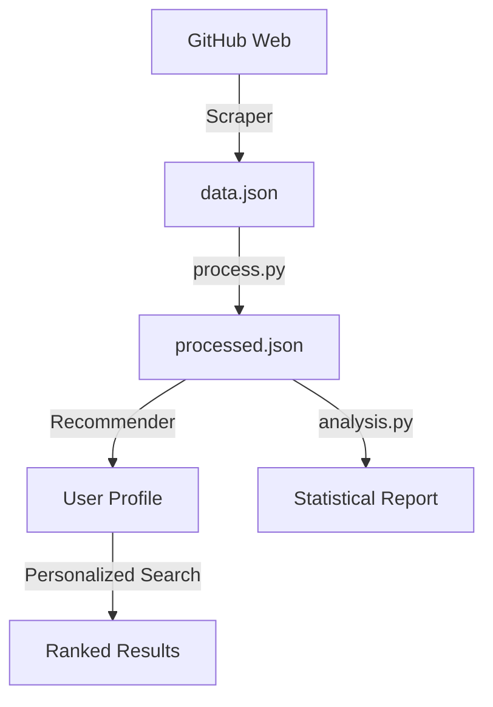

# 🌊 Data Pipeline Specification

This document details the technical flow and algorithmic implementation of the Web Intelligence Data Pipeline, now evolved into a **Personalized Discovery Engine**.

---

## 1. Data Collection Layer (`scraper.py`)
**Goal:** Acquire a high-quality corpus of ~200 GitHub repositories.

- **Ethical Crawling:** Uses `urllib.robotparser` to dynamically fetch and respect GitHub's `robots.txt` for every request.
- **Discovery Strategy:** Iterates through technical topics (ML, Python, Web Dev) and paginates until the target count is reached.
- **Content Extraction:** 
  - Primary: Meta description tags.
  - Secondary: "About" section CSS selectors.
  - Cleaning: Regex-based removal of GitHub UI boilerplate ("Contribute to...").
- **Persistence:** Incremental saves to `data.json` to prevent data loss.

---

## 2. Processing Layer (`process.py`)
**Goal:** Transform raw text into weighted, search-optimized tokens.

- **NLP Pipeline:**
  1. **Tokenization:** Lowercasing and regex-based word extraction.
  2. **Lemmatization:** Root word extraction via `WordNetLemmatizer`.
  3. **Stemming:** Suffix stripping via `PorterStemmer`.
  4. **Stopword Removal:** Standard NLTK list + 20+ domain-specific noise terms.
- **Field Weighting:** Title (4x), Description (2x), Metadata (2x), README (1x).

---

## 3. Personalization & Discovery Layer (`smart_profile_recommender_v2.py`)
**Goal:** Tailor repository discovery to specific user needs and preferences.

### **A. User Profiling**
- **Dynamic Options:** Generates profile choices (languages, topics) directly from the `processed.json` dataset.
- **Dimensions:** Captures user intent across Project Type, Language, Goal (Learning vs. Contribution), Skill Level, and Complexity.

### **B. Recommendation Engine**
- **Profile Matching:** Ranks documents based on multi-dimensional similarity to the user's profile.
- **Cold-Start Discovery:** Provides high-quality "Recommended for You" results even without a search query.

### **C. Personalized Search (IR)**
- **Integrated BM25:** Implements probabilistic lexical ranking within the recommender logic.
- **Hybrid Scoring:** Combines Query Relevance ($BM25$) with Profile Alignment ($Personalization$).
- **Query Expansion:** Automatically expands domain terms (e.g., "AI" -> "Machine Learning", "Neural Networks") to improve recall.

---

## 4. Analytics Layer (`analysis.py`)
**Goal:** Dataset evaluation and statistical profiling.

- **Metrics:** Vocab density, average document length, and term frequency (TF).
- **Insights:** Visualizes the distribution of programming languages and technical topics across the crawled corpus.

---

## 📊 Data Flow Diagram

