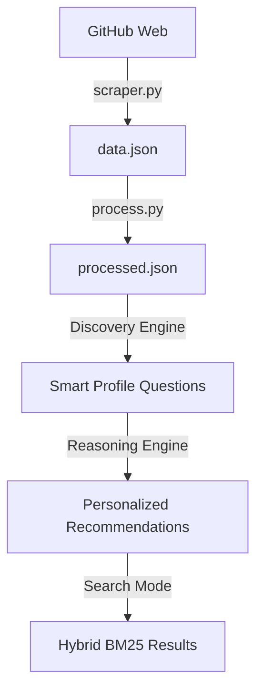

# 🌊 Data Pipeline & Discovery Specification

This document details the technical implementation of the **Personalized Discovery Engine**, a unified system for web intelligence collection, NLP processing, and intelligent recommendation.

---

## 1. Data Collection Layer (`scraper.py`)
- **Ethical Crawling:** Implements `urllib.robotparser` for real-time `robots.txt` compliance.
- **Throttled Discovery:** 1.2s delay between requests to minimize server load.
- **Fail-Safe Persistence:** Incremental checkpointing every 20 records into `data.json`.
- **Boilerplate Removal:** Targeted regex stripping of GitHub-specific UI text from extracted content.

---

## 2. Processing Layer (`process.py`)
- **Dual Normalization:** Executes both **Porter Stemming** and **WordNet Lemmatization** to ensure high recall and precision.
- **Stopword Filtration:** Uses a multi-tier stopword list (Standard English + Technical Noise + Domain Specific).
- **Boost Factor Model:**
  - **Title:** 4.0x (Primary Signal)
  - **Metadata/Topics:** 2.0x (Structured Signal)
  - **Description:** 2.0x (Contextual Signal)
  - **README/Content:** 1.0x (Raw Content)
- **Feature Engineering:** Maps stars/forks into discrete IR tokens (`very_popular`, `highly_forked`) for ranking influence.

---

## 3. Intelligence Layer (`smart_profile_recommender_v2.py`)

### **A. Algorithmic Query Expansion**
- **Domain Mapping:** Automatically expands broad queries into specific technical sub-topics (e.g., "AI" → "Computer Vision", "NLP", "Neural Networks").
- **Synonym Injection:** Improves recall by matching related technical terms not explicitly present in the query.

### **B. Hybrid Scoring Formula**
The engine calculates a `Final Score` for every document using a multi-objective function:
$$Score_{Total} = Score_{Query} + Score_{Profile}$$

1.  **Query Score ($BM25$):**
    - Probabilistic relevance based on term frequency and document length normalization.
    - Parameters: $k1=1.5, b=0.75$.
2.  **Profile Score:**
    - Calculates alignment across 6 dimensions: Project Type, Language, User Goal, Skill Level, Repository Kind, and Architectural Complexity.

### **C. Reasoning Engine**
- **Explainability:** Generates a list of reasons ("Why") for each recommendation by identifying which profile dimensions matched the document's metadata (e.g., "Matches your preferred skill level: Intermediate").

---

## 4. Analytics Layer (`analysis.py`)
- **Dataset Profiling:** Generates metrics on vocabulary density, average document length, and popularity distribution.
- **Visual Exploration:** Console-based visualization of technology trends within the crawled dataset.

---

## 📊 Data Flow Architecture

scraper.py
   ↓
data.json

process.py
   ↓
processed.json

index_to_qdrant.py
   ↓
Qdrant collection: github_repos

FastAPI backend
   ↓
searches Qdrant + BM25