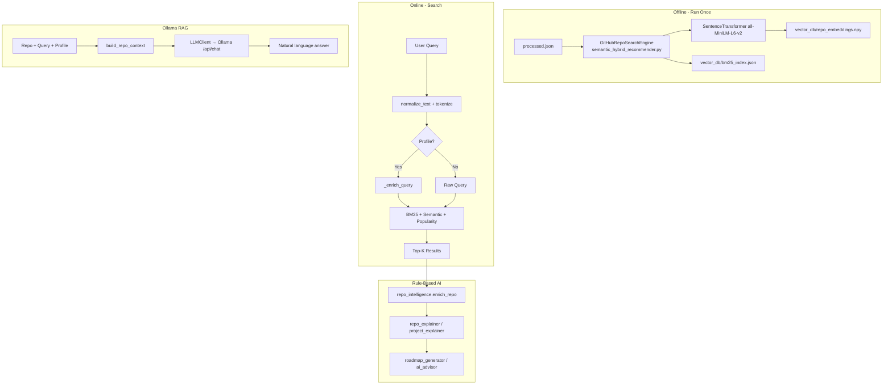

# RepoMind AI — AI Pipeline

## Overview

RepoMind AI has **two complementary AI systems**:

1. **Rule-based pipeline** — template/keyword-driven, instant, no external services
2. **Ollama RAG pipeline** — local LLM with grounded repo context, requires Ollama server

The IR search layer (BM25 + embeddings) is separate from both AI layers.

---

## Full Pipeline Architecture



---

## Part 1 — Search Index (Offline + Lazy)

### Embeddings

**File:** `semantic_hybrid_recommender.py` → `GitHubRepoSearchEngine._load_or_build_embeddings()`

| Setting | Value |
|---|---|
| Model | `sentence-transformers/all-MiniLM-L6-v2` |
| Dimensions | 384 |
| Normalized | Yes (`normalize_embeddings=True`) |
| Storage | `vector_db/repo_embeddings.npy` (float32) |
| Batch size | 32 repos per encode |
| Cache key | SHA-256 fingerprint of dataset |

**Input text per repo (`_repo_text()`):**

```
Repository: {full_name}
Title: {title}
Description: {description}
Language: {language}
Topics: {topics}
License: {license}
README: {readme[:4000]}
Tokens: {processed_tokens[:2500]}
```

### BM25 Index

**File:** `semantic_hybrid_recommender.py` → `BM25Index`

| Parameter | Value |
|---|---|
| Algorithm | Okapi BM25 (pure Python) |
| k1 | 1.5 |
| b | 0.75 |
| IDF | `log(1 + (N - df + 0.5) / (df + 0.5))` |
| Storage | `vector_db/bm25_index.json` |

**Tokenization:** Regex word extraction, lowercase, default stopwords removed.

---

## Part 2 — Hybrid Search Scoring (Online)

**File:** `semantic_hybrid_recommender.py` → `GitHubRepoSearchEngine.search()`

```
final_score = 0.45 × BM25_norm + 0.45 × Semantic_norm + 0.10 × Popularity_norm
```

| Component | Method |
|---|---|
| BM25 | Raw scores → min-max normalized to [0, 1] |
| Semantic | Cosine similarity → shifted: `(cosine + 1) / 2` |
| Popularity | `log1p(stars) + 0.35 × log1p(forks)` → min-max normalized |
| Weak match filter | Excludes results where `bm25 ≤ 0 AND semantic < 0.52` |

### Profile Query Enrichment

**Files:** `backend/core/semantic_loader.py` → `_enrich_query()`, `smart_profile_recommender_v2.py`

When profile is provided:
1. `expand_topics_from_project_type()` maps project type to topic keywords
2. `to_profile_query()` concatenates language, topics, goal, level, repo_kind, complexity
3. Enriched query = `"{original_query} {profile_query}"`

---

## Part 3 — Profile Recommendation (No Query)

**File:** `smart_profile_recommender_v2.py` → `SmartProfileRecommender.recommend_for_profile()`

| Component | Weight | Method |
|---|---|---|
| Project Type | 25% | Topic intersection with doc terms |
| Language | 20% | Exact match → 1.0, secondary → 0.7 |
| Goal | 20% | Signal keyword matching |
| Level | 15% | Signal keyword matching |
| Repo Kind | 10% | Signal keyword matching |
| Complexity | 5% | README length + topic count heuristic |
| Profile Keyword | 5% | BM25-like keyword coverage |

### Personalized Search Weights (query + profile)

```
final = 0.60×query + 0.10×project_type + 0.10×language + 0.08×goal
      + 0.05×level + 0.04×repo_kind + 0.03×complexity
```

---

## Part 4 — Rule-Based Repository Intelligence

**File:** `backend/core/repo_intelligence.py` → `enrich_repo()`

| Feature | Method |
|---|---|
| `tech_stack` | Regex keyword matching (30+ technology aliases) |
| `readme_sections` | Heading detection: installation, usage, examples, contributing, license, api, testing, deployment, security |
| `documentation_score` | README length + present sections (weighted) |
| `contribution_score` | Contribution keywords + contributing section + open issues |
| `health_score` | Composite: 25% docs + 10% contribution + 20% stars + 10% forks + 20% activity + 15% quality |
| `difficulty` | Beginner/advanced keyword ratios + tech stack count |
| `repo_intents` | Scores for: learning, contribution, production, research, tool_usage, portfolio |

### Repo Explainer (`repo_explainer.py`)

| Output | Source |
|---|---|
| `summary` | Template from name, language, topics, description, tech stack |
| `best_for` | Intent + profile goal matching |
| `strengths` / `weaknesses` | Up to 6 positive / 5 negative signals |
| `why_recommended` | Query match, BM25/semantic scores, profile alignment |
| `roadmap` | From `roadmap_generator.generate_roadmap()` |

### Project Explainer (`project_explainer.py`)

Adds over repo_explainer:
- `readme_preview` (first 700 chars, markdown stripped)
- `section_snippets` (actual text from each README section)
- `how_to_use_it`, `contribution_guidance`
- `scores_interpretation` (Strong/Medium/Limited/Weak labels)
- Full `metrics` block

### Roadmap Generator (`roadmap_generator.py`)

| Goal contains | Type | Steps focus |
|---|---|---|
| learn, education | `learning` | README → install → example → study → modify |
| contribut, open-source | `contribution` | README → install → contributing → issues → PR |
| production, use, tool | `production` | README → install → license → tests → deploy |
| portfolio, project | `portfolio` | README → fork → customize → document → deploy |
| fallback | `general` | README → install → run → explore |

### AI Advisor (`ai_advisor.py`)

For top-K search results:

```
advisor_score = 0.35×final_search_score + 0.15×semantic + 0.10×profile
              + 0.15×documentation + 0.15×health + goal_bonus
```

Sorts by `advisor_score`, generates summary text and roadmap for best repo.

---

## Part 5 — Ollama RAG Pipeline

**Files:** `backend/core/rag_advisor.py`, `backend/core/llm_client.py`, `backend/api/rag.py`

### Context Building

`build_repo_context()` serializes into a single prompt block:

- User query and profile
- Repository metadata (name, URL, description, language, topics, stars, forks, license, dates)
- Search scores and breakdown
- Full README text from the repo object

### LLM Client

**File:** `backend/core/llm_client.py`

| Setting | Env var | Default |
|---|---|---|
| Ollama URL | `OLLAMA_BASE_URL` | `http://127.0.0.1:11434` |
| Model | `OLLAMA_MODEL` | `qwen2.5:1.5b` |
| Temperature | hardcoded | 0.2 |
| Max tokens | hardcoded | 800–900 |
| Timeout | hardcoded | 180 seconds |

Calls `POST {OLLAMA_BASE_URL}/api/chat` with `stream: false`.

### Explain Prompt Structure

System: "Use ONLY the provided repository data. Do not invent missing details."

User requests 8 sections:
1. Short Summary
2. What this repository is useful for
3. Main technologies
4. Why it matches user query/profile
5. Strengths
6. Limitations or missing data
7. How to start with it
8. Final recommendation

### Roadmap Prompt Structure

User requests 8 sections:
1. Roadmap Goal
2. Before You Start
3. Step-by-Step Roadmap
4. What to focus on in the README
5. Small project/task to try
6. Contribution path if possible
7. Missing data or risks
8. Next step

### Response Shape

```json
{
  "mode": "rag_ollama",
  "model": "qwen2.5:1.5b",
  "answer": "... free text ..."
}
```

Frontend (`RagAnswerModal.jsx`) renders `answer` as paragraphs/headings.

---

## Pipeline Summary Table

| Stage | File | External deps | Output |
|---|---|---|---|
| Embeddings | `semantic_hybrid_recommender.py` | sentence-transformers | `vector_db/repo_embeddings.npy` |
| BM25 | `semantic_hybrid_recommender.py` | None | `vector_db/bm25_index.json` |
| Hybrid Search | `semantic_hybrid_recommender.py` | ST model (loaded) | Ranked results |
| Query Enrichment | `smart_profile_recommender_v2.py` | None | Expanded query |
| Profile Recommend | `smart_profile_recommender_v2.py` | None | Profile-matched repos |
| Repo Enrichment | `repo_intelligence.py` | None | Enriched repo dict |
| Repo Explanation | `repo_explainer.py` | None | Structured JSON |
| Project Explainer | `project_explainer.py` | None | Deep structured JSON |
| Roadmap | `roadmap_generator.py` | None | Step list |
| Advisor Summary | `ai_advisor.py` | None | Advisory paragraph |
| RAG Explain/Roadmap | `rag_advisor.py` | Ollama | Free-text answer |

---

## Setting Up Ollama for RAG

```bash
# Install Ollama (https://ollama.com), then:
ollama serve
ollama pull qwen2.5:1.5b

# Optional env overrides in .env:
OLLAMA_BASE_URL=http://127.0.0.1:11434
OLLAMA_MODEL=qwen2.5:1.5b
```

If Ollama is not running, RAG endpoints return HTTP 500. Rule-based features continue to work.
