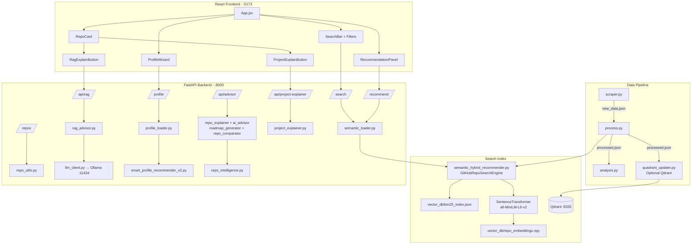
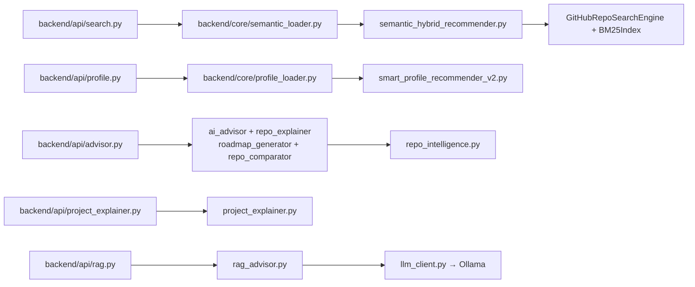

# RepoMind AI — Architecture

## Overview

RepoMind AI is a layered system:

1. **Data Pipeline** — scraping, processing, analysis (offline)
2. **Search Indexing** — BM25 + semantic embeddings (lazy-built, cached in `vector_db/`)
3. **FastAPI Backend** — 7 API routers
4. **React Frontend** — single-page app over HTTP
5. **Dual AI Layer** — rule-based (instant) + Ollama RAG (optional, local LLM)

---

## Full Architecture Diagram



---

## Component Relationships

### Frontend → Backend (actively wired in App.jsx)

| Frontend Component | Backend Endpoint | Description |
|---|---|---|
| `SearchBar.jsx` | `POST /search/` | Hybrid search |
| `Filters.jsx` | `GET /repos/filters/options` | Filter dropdown values |
| `ProfileWizard.jsx` | `GET /profile/questions` | Wizard questions |
| `ProfileWizard.jsx` | `POST /profile/recommend` | Profile recommendations |
| `RepoCard.jsx` | `POST /search/explain` | "Why this result?" score breakdown |
| `ProjectExplainButton.jsx` | `POST /api/project-explainer/explain` | Rule-based deep analysis |
| `RagExplainButton.jsx` | `POST /api/rag/explain` | Ollama explanation |
| `RagExplainButton.jsx` (roadmap mode) | `POST /api/rag/roadmap` | Ollama roadmap |
| `RecommendationPanel.jsx` | `POST /recommend/` | Similar repos |

### Frontend → Backend (API exists, UI not mounted in App.jsx)

| Frontend Component | Backend Endpoint | Status |
|---|---|---|
| `AdvisorButtons.jsx` | `POST /api/advisor/*` | Component exists, not used in App |
| `AdvisorSummaryPanel.jsx` | `POST /api/advisor/summary` | Component exists, not used in App |
| `RoadmapPanel.jsx` | `POST /api/advisor/roadmap` | Component exists, not used in App |
| `RepoCompareModal.jsx` | `POST /api/advisor/compare` | Component exists, not used in App |
| `RepoExplainerPanel.jsx` | `POST /api/advisor/explain` | Component exists, not used in App |

---

## Backend Internal Dependencies



---

## Data Flows

### Search Flow

```
User types query (+ optional profile)
→ POST /search/ {query, filters, profile}
→ semantic_loader.hybrid_search()
→ Profile query enrichment (unless query-only mode on frontend)
→ GitHubRepoSearchEngine.search()
  → BM25 scores (lexical, min-max normalized)
  → Semantic cosine scores (embedding similarity)
  → Popularity scores (log stars + forks)
  → Weighted combination + filter pass
→ normalize_search_result()
→ Ranked list to frontend
```

### Profile Recommendation Flow

```
User completes ProfileWizard
→ GET /profile/questions (from smart_profile_options.json)
→ POST /profile/recommend {project_type, language, goal, level, repo_kind, complexity}
→ SmartProfileRecommender.recommend_for_profile()
  → Multi-dimensional weighted scoring
→ Sorted results with why_recommended + score_breakdown
```

### Rule-Based Project Explainer Flow

```
User clicks "Explain Project"
→ POST /api/project-explainer/explain {repo, profile, query}
→ project_explainer.explain_project()
  → README section detection + snippet extraction
  → Tech stack keyword matching
  → Documentation / contribution / health scores
  → Structured response (metrics, strengths, how_to_use_it, etc.)
```

### Ollama RAG Flow

```
User clicks "Explain with AI" or "AI Roadmap"
→ POST /api/rag/explain or /api/rag/roadmap {repo, query, profile}
→ rag_advisor.build_repo_context() — serializes repo fields + README
→ LLMClient.generate() → Ollama /api/chat
→ Natural-language answer (mode: "rag_ollama")
```

### AI Advisor Summary Flow (API only, not in main UI)

```
POST /api/advisor/summary {query, profile, results[top5]}
→ ai_advisor.advise()
  → enrich + explain each result
  → advisor_score ranking
  → build_summary() + roadmap for best repo
```

---

## Key Design Decisions

| Decision | Rationale |
|---|---|
| Dual AI: rule-based + Ollama | Rule-based is instant and deterministic; Ollama adds natural language when available locally |
| No cloud LLM API | RAG uses local Ollama — no API keys, no cost, data stays local |
| Search engine at project root | `semantic_hybrid_recommender.py` is both the engine and CLI; imported as `SemanticHybridRecommender` alias |
| Singleton loaders | `_hybrid` and `_recommender` globals prevent reloading models per request |
| Index in `vector_db/` | Single canonical index directory (fingerprint-based cache invalidation) |
| `repo_utils.py` at root | Shared between backend and data pipeline without package boundary issues |
| Lazy index build | Fast startup; first search pays the embedding cost (~1–5 min) |
| Profile stored in localStorage | No auth required; profile persists across sessions |
| Qdrant optional | Main search uses local NumPy; Qdrant is an upgrade path only |
| Postgres in docker-compose | Prepared for future persistence; not connected to app code yet |

---

## AI System Comparison

| Aspect | Rule-Based (`/api/advisor`, `/api/project-explainer`) | Ollama RAG (`/api/rag`) |
|---|---|---|
| Speed | Instant (<100ms) | Slow (5–60s depending on model/hardware) |
| External deps | None | Ollama server running locally |
| Output format | Structured JSON | Free-text markdown-like answer |
| Hallucination risk | Low (template-driven) | Mitigated by "use ONLY provided data" prompt |
| Used in main UI | Explain Project button | Explain with AI + AI Roadmap buttons |
| Best for | Metrics, sections, score interpretation | Narrative explanations, personalized roadmaps |
