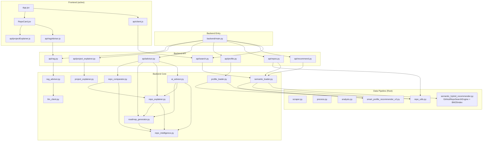

# RepoMind AI — Dependency Graph

## Internal Module Dependency Map



---

## Textual Dependency List

### `backend/main.py`
- **Imports:** all 7 `backend/api/*` routers
- **Used by:** uvicorn entry point

### `backend/api/search.py`
- **Imports:** `semantic_loader`, `search_schema`
- **Used by:** `main.py`

### `backend/api/recommend.py`
- **Imports:** `semantic_loader`, `search_schema`
- **Used by:** `main.py`

### `backend/api/repos.py`
- **Imports:** `semantic_loader`, `repo_utils` (root)
- **Used by:** `main.py`

### `backend/api/profile.py`
- **Imports:** `profile_loader`, `profile_schema`
- **Used by:** `main.py`

### `backend/api/advisor.py`
- **Imports:** `ai_advisor`, `repo_explainer`, `roadmap_generator`, `repo_comparator`, `advisor` schema
- **Used by:** `main.py`

### `backend/api/project_explainer.py`
- **Imports:** `project_explainer`, `project_explainer` schema
- **Used by:** `main.py`

### `backend/api/rag.py`
- **Imports:** `rag_advisor`
- **Used by:** `main.py`

### `backend/core/semantic_loader.py`
- **Imports:** `repo_utils`, `semantic_hybrid_recommender`, `smart_profile_recommender_v2` (all root-level)
- **Used by:** search, recommend, repos APIs

### `backend/core/profile_loader.py`
- **Imports:** `smart_profile_recommender_v2`, `repo_utils`
- **Used by:** profile API

### `backend/core/rag_advisor.py`
- **Imports:** `llm_client`
- **Used by:** rag API

### `backend/core/llm_client.py`
- **Imports:** `requests`, `os` (stdlib)
- **External:** Ollama HTTP API at `:11434`
- **Used by:** `rag_advisor`

### `backend/core/repo_intelligence.py`
- **Imports:** stdlib only (`re`, `math`, `datetime`)
- **Used by:** repo_explainer, roadmap_generator, ai_advisor, repo_comparator

### `backend/core/project_explainer.py`
- **Imports:** stdlib only — self-contained
- **Used by:** project_explainer API

### `semantic_hybrid_recommender.py` (root)
- **Imports:** `numpy`, `sentence_transformers`, stdlib
- **Exports:** `GitHubRepoSearchEngine`, `BM25Index`, `SemanticHybridRecommender` (alias)
- **Used by:** `semantic_loader`

### `smart_profile_recommender_v2.py` (root)
- **Imports:** stdlib only
- **Used by:** `semantic_loader`, `profile_loader`

### `repo_utils.py` (root)
- **Imports:** stdlib only
- **Used by:** `semantic_loader`, `profile_loader`, repos API

---

## Circular Dependency Analysis

**No circular dependencies found.**

Flow is strictly one-directional:

```
Frontend → API routes → Core services → Root modules → Third-party / Ollama
```

---

## External Dependencies

### Python

| Package | Version (tested) | Used by |
|---|---|---|
| `fastapi` | 0.136+ | All API routes |
| `uvicorn[standard]` | 0.47+ | Process runner |
| `pydantic` | 2.12+ | All schemas |
| `numpy` | 2.4+ | `semantic_hybrid_recommender.py` |
| `sentence-transformers` | 5.5+ | Search engine embeddings |
| `nltk` | 3.9+ | `process.py` |
| `requests` | 2.32+ | `scraper.py`, `llm_client.py` |
| `beautifulsoup4` | 4.14+ | `scraper.py` |
| `python-dotenv` | 1.2+ | `scraper.py`, `quadrant_updater.py` |
| `qdrant-client` | 1.18+ | `quadrant_updater.py` (optional) |

### External Services

| Service | Port | Used by |
|---|---|---|
| Ollama | 11434 | `llm_client.py` → RAG endpoints |
| Qdrant | 6333 | `quadrant_updater.py` (optional) |
| PostgreSQL | 5433 | `docker-compose.yml` (not wired) |

### Frontend (npm)

| Package | Version | Used by |
|---|---|---|
| `react` | ^19.2 | All components |
| `react-dom` | ^19.2 | `main.jsx` |
| `axios` | ^1.16 | `client.js`, `advisor.js` |
| `lucide-react` | ^1.16 | UI icons |
| `vite` | ^8.0 | Build tool |
| `@vitejs/plugin-react` | ^6.0 | Vite plugin |

---

## Import Constraint (Critical)

Root-level modules (`repo_utils`, `semantic_hybrid_recommender`, `smart_profile_recommender_v2`) are imported with **bare names** (not package-relative). This requires:

```bash
# CORRECT — from project root
uvicorn backend.main:app --reload --port 8000

# WRONG — will fail with ModuleNotFoundError
cd backend && uvicorn main:app
```
