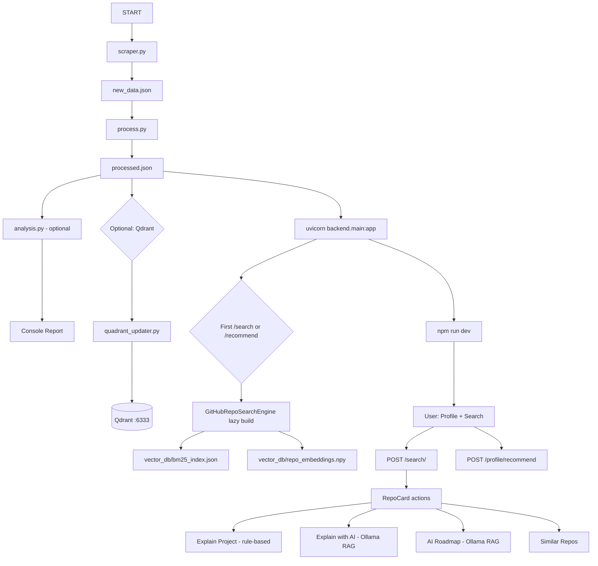

# RepoMind AI — Execution Pipeline

## Pipeline Overview



---

## Step 1 — GitHub Repository Scraping

| | |
|---|---|
| **Script** | `scraper.py` |
| **Class** | `FastGitHubScraper` |
| **Input** | GitHub website + GitHub REST API |
| **Output** | `new_data.json`, `cache.json` |
| **Env** | `GITHUB_TOKEN` (optional) |

**Process:**
1. `get_topics()` — crawls github.com/topics (up to 50 topics)
2. `crawl_topic_repos()` — pages 1–5 per topic, collects owner/repo URLs
3. `scrape_repo()` — GitHub API `/repos/{owner}/{repo}` + readme
4. ThreadPoolExecutor parallel fetch; auto-save every 20 repos

**Output schema per record:**
```json
{
  "url": "https://github.com/owner/repo",
  "name": "repo",
  "full_name": "owner/repo",
  "description": "...",
  "stars": 1234,
  "forks": 56,
  "language": "Python",
  "topics": ["machine-learning"],
  "readme": "# README...",
  "readme_length": 5000
}
```

---

## Step 2 — Data Processing (NLP)

| | |
|---|---|
| **Script** | `process.py` |
| **Function** | `process_data(input_file="new_data.json", output_file="processed.json")` |
| **Input** | `new_data.json` |
| **Output** | `processed.json` |
| **Deps** | NLTK (stopwords, wordnet) |

**Process:**
1. `normalize_item()` — standardize numeric fields
2. `clean_text()` — lowercase, remove URLs, lemmatize, preserve `c++`/`c#`
3. Field-weighted tokens: title×5 + desc×3 + meta×3 + readme×1 + pop_tokens
4. `compute_popularity_score()`, `compute_activity_score()`, `compute_quality_score()`
5. Synthetic popularity tokens (`extremely_popular`, `very_popular`, etc.)

**Added fields per record:** `tokens`, `title_tokens`, `desc_tokens`, `readme_tokens`, `doc_length`, `popularity_score`, `activity_score`, `quality_score`, `processed_text`

---

## Step 3 — Dataset Analysis (Optional)

| | |
|---|---|
| **Script** | `analysis.py` |
| **Input** | `processed.json` |
| **Output** | Console report only |

Reports: doc count, vocab size, top terms, top languages/topics, avg stars/forks, top repos.

---

## Step 4 — Search Index Building (Lazy)

| | |
|---|---|
| **Engine** | `semantic_hybrid_recommender.py` → `GitHubRepoSearchEngine` |
| **Triggered by** | First `load_semantic_hybrid()` call |
| **Input** | `processed.json` |
| **Output** | `vector_db/bm25_index.json`, `vector_db/repo_embeddings.npy`, `vector_db/repo_metadata.json` |
| **Deps** | sentence-transformers, numpy |

**Process:**
1. Load docs from `processed.json`; filter to real GitHub repos
2. Compute SHA-256 fingerprint; skip rebuild if cache matches
3. Build BM25 index → save JSON
4. Encode all repo texts with `all-MiniLM-L6-v2` → save `.npy`
5. Save metadata fingerprint

**First request takes 1–5 minutes.** Subsequent requests use cache.

---

## Step 5 — Qdrant Upload (Optional)

| | |
|---|---|
| **Script** | `quadrant_updater.py` |
| **Input** | `processed.json` + running Qdrant |
| **Output** | Qdrant collection |

Main backend does **not** use Qdrant for search.

---

## Step 6 — FastAPI Backend Startup

```bash
uvicorn backend.main:app --reload --port 8000
```

| | |
|---|---|
| **Required files** | `processed.json` (must exist before first search) |
| **Lazy-generated** | `vector_db/*` on first search/recommend |
| **Routers** | 7 (search, recommend, repos, profile, advisor, project_explainer, rag) |

No models loaded at startup — lazy on first IR request.

---

## Step 7 — Frontend Startup

```bash
cd frontend && npm install && npm run dev
```

| | |
|---|---|
| **URL** | http://localhost:5173 |
| **Proxy** | `/api` → `http://127.0.0.1:8000` (strips `/api` prefix) |

---

## Step 8 — Ollama (Optional, for RAG)

```bash
ollama serve
ollama pull qwen2.5:1.5b
```

Required for "Explain with AI" and "AI Roadmap" buttons. Rule-based features work without Ollama.

---

## Online Request Flows

### Search (`POST /search/`)

```
Input: {query, top_k, filters, profile}
→ hybrid_search() → GitHubRepoSearchEngine.search()
→ 0.45×BM25 + 0.45×Semantic + 0.10×Popularity
→ normalize_search_result() per item
Output: {query, count, engine, results[]}
```

### Profile Recommend (`POST /profile/recommend`)

```
Input: {project_type, language, goal, level, repo_kind, complexity, top_k}
→ SmartProfileRecommender.recommend_for_profile()
→ weighted multi-dimensional scoring
Output: {count, engine, profile, results[]}
```

### Explain Project (`POST /api/project-explainer/explain`)

```
Input: {repo, profile, query}
→ explain_project() — README parsing, scores, sections
Output: structured JSON (metrics, strengths, how_to_use_it, etc.)
```

### RAG Explain (`POST /api/rag/explain`)

```
Input: {repo, query, profile}
→ build_repo_context() → LLMClient → Ollama
Output: {mode, model, answer}
```

### Similar Repos (`POST /recommend/`)

```
Input: {repo_identifier, top_k, same_language_only}
→ recommend_similar() → cosine similarity over embeddings
Output: {repo_identifier, count, results[]}
```

### AI Advisor Summary (`POST /api/advisor/summary`) — API only

```
Input: {query, profile, results[top5]}
→ advise() → enrich, explain, score, summarize
Output: {summary, recommended_repo, roadmap, top_explanations}
```

---

## Typical Development Session

```bash
# Terminal 1 — backend (from project root)
uvicorn backend.main:app --reload --port 8000

# Terminal 2 — frontend
cd frontend && npm run dev

# Terminal 3 — Ollama (optional)
ollama serve
```

Open http://localhost:5173 → complete profile wizard → search → try repo actions.
